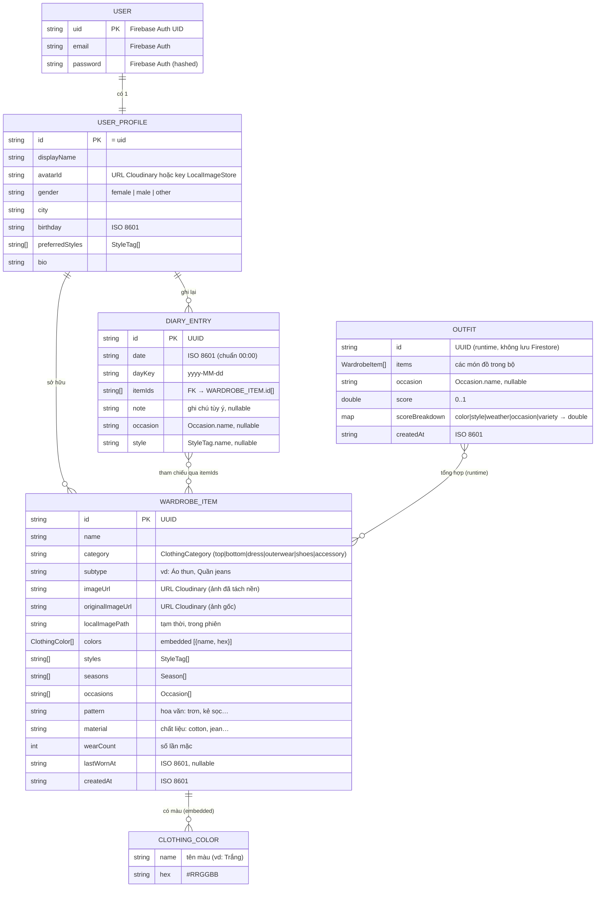
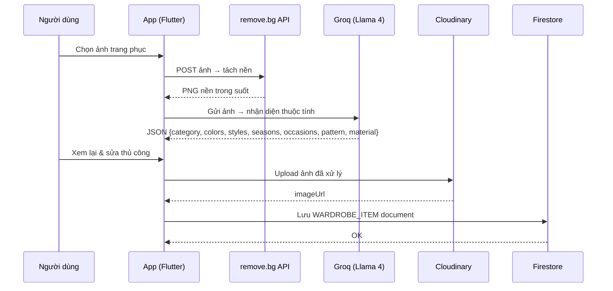

# SƠ ĐỒ ERD — ỨNG DỤNG TỦ ĐỒ THÔNG MINH

> **Kiến trúc lưu trữ:** Firebase Auth + Cloud Firestore + Cloudinary  
> **Ngày cập nhật:** 2026-06-17

---

## 1. BẢNG ERD — Chi tiết các Entity

### 📋 Entity: USER
> Lưu ở **Firebase Authentication** — không có document Firestore riêng.

| STT | Thuộc tính | Kiểu dữ liệu | Khóa | Bắt buộc | Mô tả |
|-----|-----------|--------------|------|----------|-------|
| 1 | `uid` | `String` | 🔑 PK | ✅ | UID duy nhất do Firebase Auth cấp |
| 2 | `email` | `String` | — | ✅ | Email đăng nhập |
| 3 | `password` | `String` | — | ✅ | Mật khẩu (Firebase tự hash, không lộ) |

---

### 📋 Entity: USER_PROFILE
> Lưu ở **Firestore** — Collection path: `users/{uid}`

| STT | Thuộc tính | Kiểu dữ liệu | Khóa | Bắt buộc | Mô tả |
|-----|-----------|--------------|------|----------|-------|
| 1 | `id` | `String` | 🔑 PK | ✅ | Bằng `uid` của Firebase Auth |
| 2 | `displayName` | `String` | — | ✅ | Tên hiển thị của người dùng |
| 3 | `avatarId` | `String?` | — | ❌ | URL Cloudinary hoặc key LocalImageStore |
| 4 | `gender` | `String?` | — | ❌ | `"female"` \| `"male"` \| `"other"` |
| 5 | `city` | `String?` | — | ❌ | Thành phố (vd: "Hà Nội") |
| 6 | `birthday` | `String?` | — | ❌ | Ngày sinh dạng ISO 8601 |
| 7 | `preferredStyles` | `String[]` | — | ❌ | Danh sách `StyleTag.name` yêu thích |
| 8 | `bio` | `String?` | — | ❌ | Tiểu sử ngắn |

---

### 📋 Entity: WARDROBE_ITEM
> Lưu ở **Firestore** — Collection path: `users/{uid}/items/{itemId}`

| STT | Thuộc tính | Kiểu dữ liệu | Khóa | Bắt buộc | Mô tả |
|-----|-----------|--------------|------|----------|-------|
| 1 | `id` | `String` | 🔑 PK | ✅ | UUID tự sinh |
| 2 | `name` | `String` | — | ✅ | Tên món đồ (vd: "Áo thun trắng") |
| 3 | `category` | `String` | — | ✅ | `ClothingCategory.name` (top/bottom/dress/outerwear/shoes/accessory) |
| 4 | `subtype` | `String?` | — | ❌ | Loại cụ thể (vd: "Áo thun", "Quần jeans") |
| 5 | `imageUrl` | `String?` | — | ❌ | URL Cloudinary — ảnh **đã tách nền** |
| 6 | `originalImageUrl` | `String?` | — | ❌ | URL Cloudinary — ảnh **gốc** trước tách nền |
| 7 | `localImagePath` | `String?` | — | ❌ | Đường dẫn cục bộ tạm (không lưu Firestore) |
| 8 | `colors` | `Object[]` | — | ❌ | Mảng `ClothingColor` embedded: `[{name, hex}]` |
| 9 | `styles` | `String[]` | — | ❌ | Danh sách `StyleTag.name` |
| 10 | `seasons` | `String[]` | — | ❌ | Danh sách `Season.name` phù hợp |
| 11 | `occasions` | `String[]` | — | ❌ | Danh sách `Occasion.name` phù hợp |
| 12 | `pattern` | `String?` | — | ❌ | Hoa văn (trơn, kẻ sọc, chấm bi…) |
| 13 | `material` | `String?` | — | ❌ | Chất liệu (cotton, jean, len…) |
| 14 | `wearCount` | `int` | — | ✅ | Số lần đã mặc (mặc định: 0) |
| 15 | `lastWornAt` | `String?` | — | ❌ | Lần mặc gần nhất, ISO 8601 |
| 16 | `createdAt` | `String` | — | ✅ | Ngày tạo, ISO 8601 |

---

### 📋 Entity: CLOTHING_COLOR *(Embedded trong WARDROBE_ITEM)*
> Không có collection riêng — lưu **inline** trong mảng `colors` của `WARDROBE_ITEM`.

| STT | Thuộc tính | Kiểu dữ liệu | Khóa | Bắt buộc | Mô tả |
|-----|-----------|--------------|------|----------|-------|
| 1 | `name` | `String` | — | ✅ | Tên màu (vd: "Trắng", "Xanh navy") |
| 2 | `hex` | `String` | — | ✅ | Mã màu hex dạng `#RRGGBB` |

---

### 📋 Entity: DIARY_ENTRY
> Lưu ở **Firestore** — Collection path: `users/{uid}/diary/{entryId}`

| STT | Thuộc tính | Kiểu dữ liệu | Khóa | Bắt buộc | Mô tả |
|-----|-----------|--------------|------|----------|-------|
| 1 | `id` | `String` | 🔑 PK | ✅ | UUID tự sinh |
| 2 | `date` | `String` | — | ✅ | Ngày mặc, ISO 8601 (chuẩn về 00:00) |
| 3 | `dayKey` | `String` | — | ✅ | Dạng `yyyy-MM-dd` — dùng để nhóm/lọc |
| 4 | `itemIds` | `String[]` | 🔗 FK → WARDROBE_ITEM | ✅ | Danh sách `WARDROBE_ITEM.id` tạo thành outfit |
| 5 | `note` | `String?` | — | ❌ | Ghi chú tùy ý của người dùng |
| 6 | `occasion` | `String?` | — | ❌ | `Occasion.name` của ngữ cảnh hôm đó |
| 7 | `style` | `String?` | — | ❌ | `StyleTag.name` phong cách hôm đó |

---

### 📋 Entity: OUTFIT *(Runtime only — không lưu Firestore)*
> Chỉ tồn tại trong **RAM** khi module gợi ý đang chạy.  
> Khi người dùng bấm "Đã mặc" → chuyển thành `DIARY_ENTRY` lưu Firestore.

| STT | Thuộc tính | Kiểu dữ liệu | Khóa | Bắt buộc | Mô tả |
|-----|-----------|--------------|------|----------|-------|
| 1 | `id` | `String` | 🔑 PK (RAM) | ✅ | UUID tạm thời |
| 2 | `items` | `WardrobeItem[]` | — | ✅ | Các đối tượng `WARDROBE_ITEM` trong bộ |
| 3 | `occasion` | `String?` | — | ❌ | `Occasion.name` — ngữ cảnh gợi ý |
| 4 | `score` | `double` | — | ✅ | Điểm phù hợp tổng `0.0 – 1.0` |
| 5 | `scoreBreakdown` | `Map<String, double>` | — | ✅ | Chi tiết điểm: `color`, `style`, `weather`, `occasion`, `variety` |
| 6 | `createdAt` | `DateTime` | — | ✅ | Thời điểm gợi ý |

---

### 📋 Bảng quan hệ giữa các Entity

| Entity A | Quan hệ | Entity B | Diễn giải | Lưu trữ |
|----------|---------|----------|-----------|---------|
| `USER` | **1 — 1** | `USER_PROFILE` | Mỗi tài khoản có đúng 1 hồ sơ (cùng `uid`) | Firebase Auth ↔ Firestore |
| `USER_PROFILE` | **1 — N** | `WARDROBE_ITEM` | Một người sở hữu nhiều món đồ | Subcollection `items/` |
| `USER_PROFILE` | **1 — N** | `DIARY_ENTRY` | Một người có nhiều mục nhật ký | Subcollection `diary/` |
| `DIARY_ENTRY` | **N — M** | `WARDROBE_ITEM` | Qua mảng `itemIds[]` (không dùng join) | `itemIds` trong `diary/` document |
| `OUTFIT` | **N — M** | `WARDROBE_ITEM` | Gộp nhiều món → 1 bộ (chỉ RAM) | Không lưu Firestore |
| `WARDROBE_ITEM` | **1 — N** | `CLOTHING_COLOR` | Một món có nhiều màu (embedded) | Inline trong `items/` document |

---

## 2. Sơ đồ ERD tổng quan (Mermaid)



---

## 2. Cấu trúc Firestore (Collection Tree)

```
firestore
└── users/                          ← Collection
    └── {uid}/                      ← Document = USER_PROFILE
        │   displayName: string
        │   avatarId:    string?
        │   gender:      string?     ("female" | "male" | "other")
        │   city:        string?
        │   birthday:    string?     (ISO 8601)
        │   preferredStyles: string[] (StyleTag names)
        │   bio:         string?
        │
        ├── items/                  ← Subcollection = WARDROBE_ITEM
        │   └── {itemId}/           ← Document
        │           name:           string
        │           category:       string   (ClothingCategory.name)
        │           subtype:        string?
        │           imageUrl:       string?  (Cloudinary URL)
        │           originalImageUrl: string?
        │           colors:         [{name, hex}][]  ← embedded ClothingColor
        │           styles:         string[]  (StyleTag names)
        │           seasons:        string[]  (Season names)
        │           occasions:      string[]  (Occasion names)
        │           pattern:        string?
        │           material:       string?
        │           wearCount:      number
        │           lastWornAt:     string?  (ISO 8601)
        │           createdAt:      string   (ISO 8601)
        │
        └── diary/                  ← Subcollection = DIARY_ENTRY
            └── {entryId}/          ← Document
                    date:     string   (ISO 8601)
                    dayKey:   string   (yyyy-MM-dd)
                    itemIds:  string[] (ref → items/{itemId})
                    note:     string?
                    occasion: string?  (Occasion.name)
                    style:    string?  (StyleTag.name)
```

> **Lưu ý:** `OUTFIT` chỉ tồn tại **ở bộ nhớ runtime** (kết quả gợi ý). Khi người dùng bấm "Đã mặc", các `itemIds` của outfit đó được ghi vào một `DIARY_ENTRY` mới trên Firestore.

---

## 3. Bảng mô tả các Enum

### ClothingCategory
| Giá trị     | Nhãn            | Là Core? |
|-------------|-----------------|----------|
| `top`       | Áo              | ✅ |
| `bottom`    | Quần/Chân váy   | ✅ |
| `dress`     | Váy/Đầm         | ✅ |
| `outerwear` | Áo khoác        | ❌ |
| `shoes`     | Giày/Dép        | ❌ |
| `accessory` | Phụ kiện        | ❌ |

### StyleTag
| Giá trị      | Nhãn       | Mô tả                     |
|--------------|------------|---------------------------|
| `casual`     | Thường ngày | Thoải mái, tự nhiên       |
| `formal`     | Trang trọng | Lịch sự, chuyên nghiệp    |
| `sporty`     | Thể thao   | Năng động, khỏe khoắn     |
| `streetwear` | Đường phố  | Cá tính, hiện đại         |
| `elegant`    | Thanh lịch | Sang trọng, tinh tế       |
| `vintage`    | Cổ điển    | Hoài cổ, retro            |
| `minimalist` | Tối giản   | Đơn giản, gọn gàng        |
| `trendy`     | Thời thượng | Hợp mốt, nổi bật         |

### Season
| Giá trị  | Nhãn | Khoảng nhiệt độ |
|----------|------|-----------------|
| `summer` | Hè   | ≥ 28°C          |
| `spring` | Xuân | 20–28°C         |
| `fall`   | Thu  | 12–20°C         |
| `winter` | Đông | < 12°C          |

### Occasion
| Giá trị  | Nhãn      |
|----------|-----------|
| `school` | Đi học    |
| `work`   | Đi làm    |
| `casual` | Dạo phố   |
| `party`  | Tiệc      |
| `sport`  | Thể thao  |
| `date`   | Hẹn hò    |
| `coffee` | Cà phê    |
| `picnic` | Dã ngoại  |
| `home`   | Ở nhà     |

### Gender (trong UserProfile)
| Giá trị  | Nhãn |
|----------|------|
| `female` | Nữ   |
| `male`   | Nam  |
| `other`  | Khác |

---

## 4. Quan hệ & Ràng buộc nghiệp vụ

| Quan hệ | Loại | Ghi chú |
|---------|------|---------|
| `USER` → `USER_PROFILE` | 1–1 | Cùng `uid`; tạo khi đăng ký |
| `USER_PROFILE` → `WARDROBE_ITEM` | 1–N | Path: `users/{uid}/items/` |
| `USER_PROFILE` → `DIARY_ENTRY` | 1–N | Path: `users/{uid}/diary/` |
| `DIARY_ENTRY` → `WARDROBE_ITEM` | N–M (qua `itemIds[]`) | Không dùng join; tham chiếu bằng ID chuỗi |
| `OUTFIT` → `WARDROBE_ITEM` | N–M (runtime) | Chỉ trong RAM; không lưu Firestore |

**Ràng buộc hợp lệ của Outfit:**
- Phải có `(top + bottom)` **hoặc** `dress`
- Mỗi `ClothingCategory` xuất hiện **tối đa 1 lần** trong 1 outfit
- Áo khoác, giày, phụ kiện là **tùy chọn**

---

## 5. Phân chia lưu trữ

| Loại dữ liệu | Nơi lưu | Ghi chú |
|---|---|---|
| Tài khoản (email, mật khẩu) | **Firebase Auth** | Quản lý bởi Firebase |
| Hồ sơ người dùng | **Firestore** `users/{uid}` | |
| Metadata trang phục | **Firestore** `users/{uid}/items/{id}` | |
| Nhật ký phối đồ | **Firestore** `users/{uid}/diary/{id}` | |
| Ảnh trang phục (đã tách nền) | **Cloudinary** | CDN, tự tối ưu WebP/AVIF |
| Ảnh gốc trước tách nền | **Cloudinary** | |
| Ảnh tạm trong phiên | **RAM** (`LocalImageStore`) | Mất khi tắt app |
| Kết quả gợi ý outfit | **RAM** | Không persist |

---

## 6. Luồng tạo dữ liệu chính


