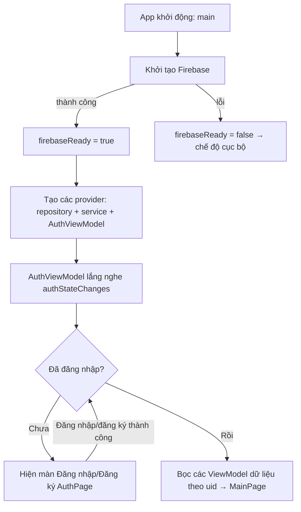
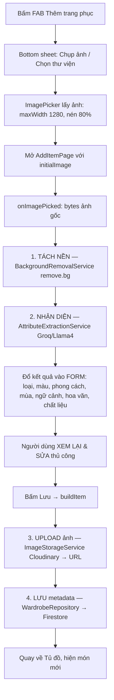
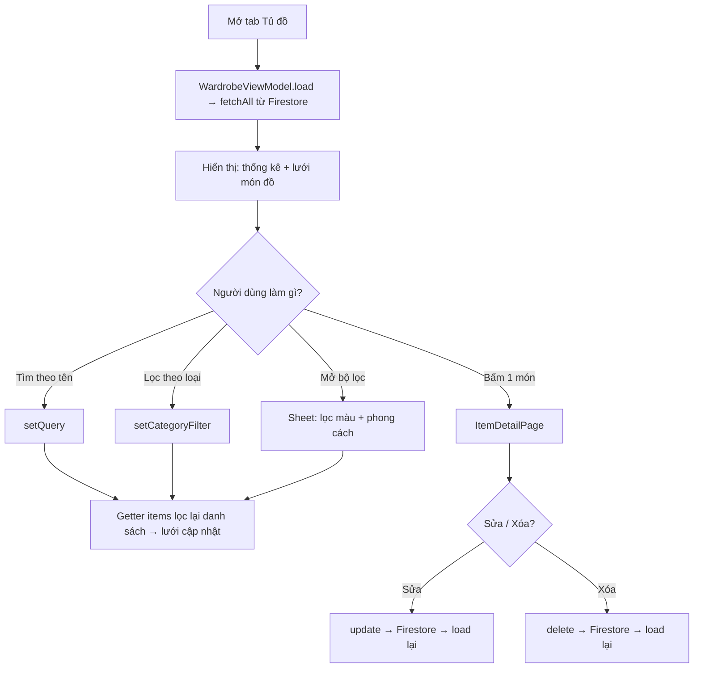
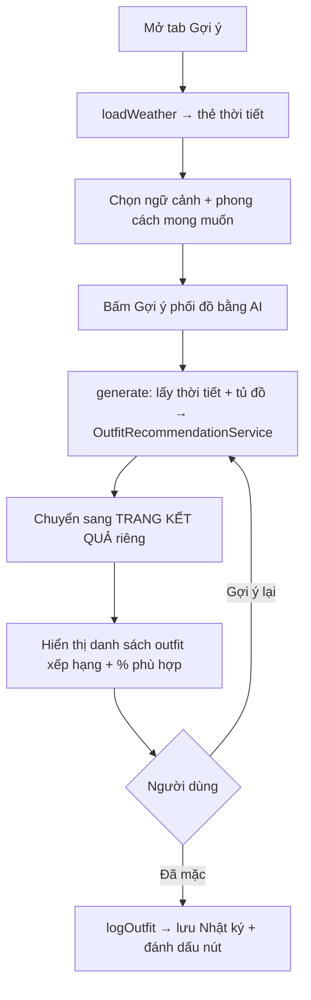
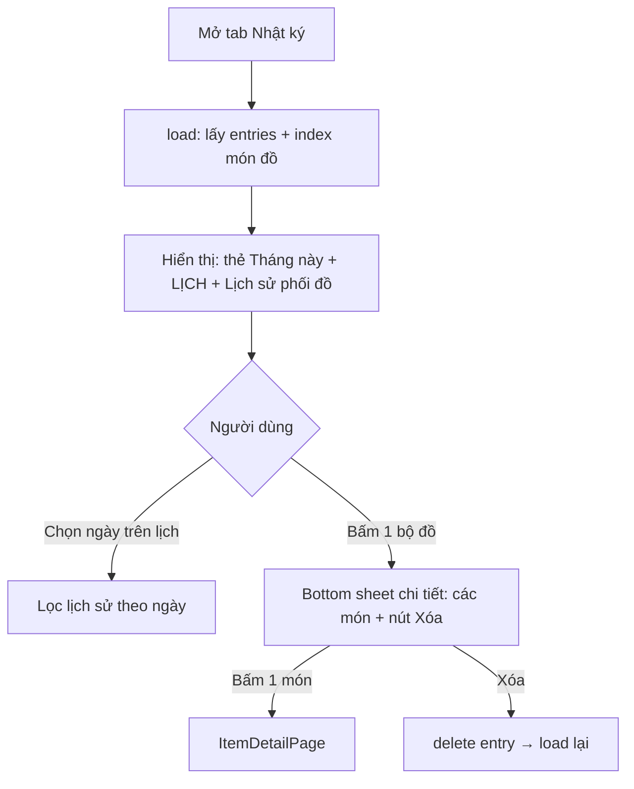
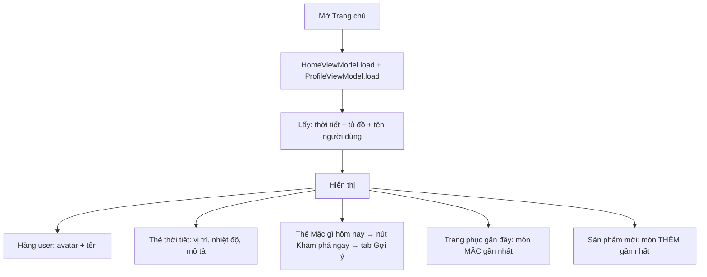
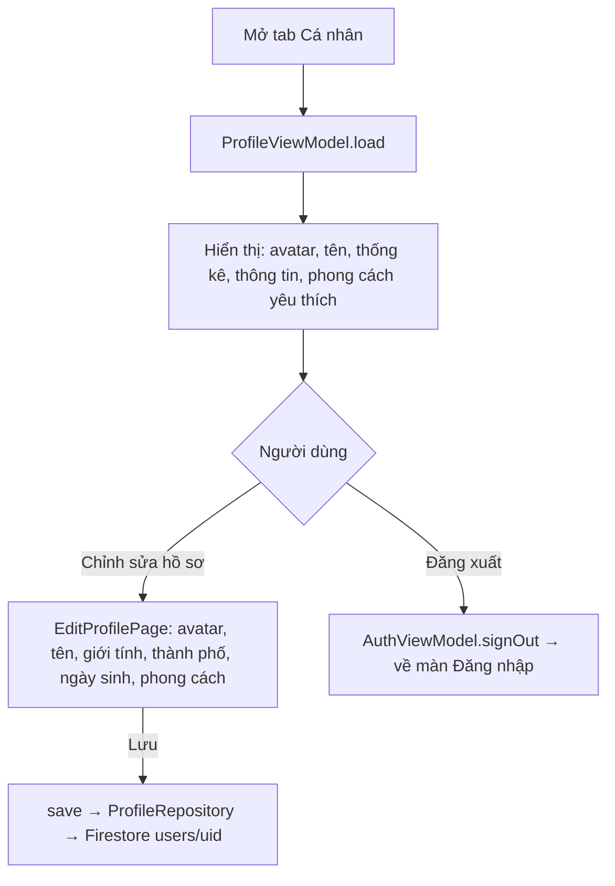
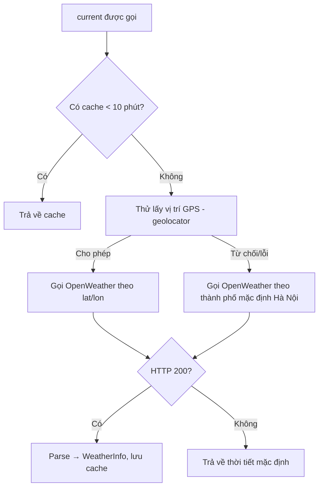

# LUỒNG HOẠT ĐỘNG CỦA ỨNG DỤNG TỦ ĐỒ THÔNG MINH

> Tài liệu mô tả chi tiết các luồng xử lý của ứng dụng **Quản lý tủ đồ & Gợi ý phối đồ** (Flutter).
> Kiến trúc: **MVVM** (Model – View – ViewModel) + `provider`.

---

## MỤC LỤC
1. [Kiến trúc tổng quan](#1-kiến-trúc-tổng-quan)
2. [Luồng khởi động & xác thực](#2-luồng-khởi-động--xác-thực)
3. [Luồng thêm trang phục (pipeline lõi)](#3-luồng-thêm-trang-phục-pipeline-lõi)
4. [Luồng quản lý tủ đồ](#4-luồng-quản-lý-tủ-đồ)
5. [Luồng gợi ý phối đồ](#5-luồng-gợi-ý-phối-đồ)
6. [Luồng nhật ký thời trang](#6-luồng-nhật-ký-thời-trang)
7. [Luồng trang chủ](#7-luồng-trang-chủ)
8. [Luồng hồ sơ cá nhân](#8-luồng-hồ-sơ-cá-nhân)
9. [Luồng dữ liệu thời tiết](#9-luồng-dữ-liệu-thời-tiết)
10. [Tầng dữ liệu & lưu trữ](#10-tầng-dữ-liệu--lưu-trữ)
11. [Cơ chế fallback & xử lý lỗi](#11-cơ-chế-fallback--xử-lý-lỗi)

---

## 1. Kiến trúc tổng quan

Ứng dụng tổ chức theo **MVVM 5 tầng**, mỗi tầng một thư mục trong `lib/`:

```
┌──────────────────────────────────────────────────────────┐
│  VIEW (views/)        Giao diện — chỉ hiển thị & nhận thao tác
│       ⇅ (đọc state / gọi hàm qua provider)
│  VIEWMODEL (viewmodels/)  Trạng thái màn hình (ChangeNotifier)
│       ⇅
│  REPOSITORY (repositories/)   Truy xuất dữ liệu (Firestore / RAM)
│  SERVICE (services/)          Tác vụ ngoài (AI, ảnh, thời tiết)
│       ⇅
│  MODEL (models/)      Cấu trúc dữ liệu (WardrobeItem, Outfit…)
└──────────────────────────────────────────────────────────┘
              ⇅ Internet
   Firebase (Auth + Firestore) · Cloudinary · Groq · remove.bg · OpenWeather
```

**Nguyên tắc:** View không bao giờ gọi thẳng Repository/Service. View → ViewModel → Repository/Service → Model. Tầng phụ thuộc được **tiêm (inject)** qua `provider` ở `main.dart`, nên dễ thay bản thật ↔ bản giả lập.

**Thành phần chính:**

| Tầng | Thành phần tiêu biểu |
|---|---|
| Models | `WardrobeItem`, `Outfit`, `DiaryEntry`, `UserProfile`, `ClothingColor`, `WeatherInfo`, các `enum` (ClothingCategory, StyleTag, Season, Occasion) |
| Repositories | `WardrobeRepository`, `DiaryRepository`, `ProfileRepository`, `AuthRepository` (mỗi cái có bản **Firestore/Firebase** và bản **InMemory/Mock**) |
| Services | `BackgroundRemovalService` (remove.bg), `AttributeExtractionService` (Groq), `ImageStorageService` (Cloudinary), `WeatherService` (OpenWeather), `OutfitRecommendationService`, `LocalImageStore` |
| ViewModels | `MainViewModel`, `AuthViewModel`, `WardrobeViewModel`, `AddItemViewModel`, `SuggestionViewModel`, `DiaryViewModel`, `HomeViewModel`, `ProfileViewModel` |
| Views | 5 tab: Trang chủ · Tủ đồ · Gợi ý · Nhật ký · Cá nhân |

---

## 2. Luồng khởi động & xác thực

**File liên quan:** `main.dart`, `viewmodels/auth_viewmodel.dart`, `repositories/firebase/firebase_auth_repository.dart`, `views/auth/auth_page.dart`.



**Các bước chi tiết:**
1. `main()` gọi `WidgetsFlutterBinding.ensureInitialized()` rồi `Firebase.initializeApp(...)`. Nếu lỗi (không mạng / chưa cấu hình) → đặt cờ `firebaseReady = false` và chạy **chế độ cục bộ** (dữ liệu RAM, không cần đăng nhập).
2. `SmartWardrobeApp` tạo `MultiProvider` chứa: các **repository** (Firestore nếu `firebaseReady`, ngược lại InMemory), các **service**, và `AuthViewModel`.
3. `AuthViewModel` đăng ký lắng nghe `authRepository.authStateChanges()` → cập nhật `user` (null = chưa đăng nhập).
4. **Cổng xác thực (`Consumer<AuthViewModel>`):**
   - `initializing` → màn loading.
   - `user == null` → **`AuthPage`** (đăng nhập / đăng ký bằng email + mật khẩu).
   - `user != null` → bọc **`_DataProviders`** (các ViewModel dữ liệu, **đặt TRÊN `MaterialApp`** để mọi route truy cập được) với **key theo `uid`** → khi đổi tài khoản, các ViewModel được tạo lại và nạp đúng dữ liệu người dùng → `MainPage`.

**Đăng nhập/Đăng ký:** `AuthPage` gọi `AuthViewModel.signIn()` / `signUp()` → `FirebaseAuthRepository` gọi Firebase Auth. Khi thành công, `authStateChanges` phát sự kiện → cổng xác thực tự chuyển sang `MainPage`. Lỗi được dịch sang tiếng Việt ("Email hoặc mật khẩu không đúng"…).

---

## 3. Luồng thêm trang phục (PIPELINE LÕI)

Đây là luồng quan trọng nhất — biến **ảnh** thành **metadata có cấu trúc**.

**File:** `views/wardrobe/widgets/add_source_sheet.dart`, `views/wardrobe/pages/add_item_page.dart`, `viewmodels/add_item_viewmodel.dart`, các service tách nền / nhận diện / lưu ảnh.



**Chi tiết từng bước:**

1. **Chọn nguồn ảnh:** FAB mở `showAddSourceSheet` (bottom sheet kiểu iOS) → người dùng chọn *Chụp ảnh* hoặc *Chọn từ thư viện*. `ImagePicker` lấy ảnh với `maxWidth: 1280, imageQuality: 80` (giảm dung lượng).
2. **Tách nền** (`AddItemViewModel.onImagePicked`): gọi `_bgService.removeBackground(bytes)`.
   - Ưu tiên **remove.bg** (API cloud): POST ảnh lên API, nhận về PNG nền trong suốt chất lượng cao.
   - Dự phòng **Google ML Kit** (on-device, offline): nếu remove.bg lỗi/hết lượt → tự động chuyển sang ML Kit Subject Segmentation.
   - Nếu cả hai đều thất bại → **giữ nguyên ảnh gốc** (không chặn luồng).
3. **Nhận diện thuộc tính:** gọi `_attrService.extract(bytes_đã_tách_nền)`.
   - Bản **Groq (Llama 4 vision)**: gửi ảnh + prompt yêu cầu trả JSON đúng schema (các giá trị enum của app). Parse → `ExtractedAttributes` (tên gợi ý, loại, màu, phong cách, mùa, ngữ cảnh, hoa văn, chất liệu).
   - Nếu lỗi → trả về **dự đoán mặc định** để người dùng vẫn sửa & lưu được.
4. **Form xác nhận** (`AddStep.editing`): toàn bộ thuộc tính được đổ vào form. Người dùng **sửa tay** nếu AI nhận sai (đáp ứng yêu cầu "cho phép chỉnh sửa").
5. **Lưu:** `buildItem()` (bất đồng bộ):
   - Sinh `id` (uuid), **upload ảnh** qua `ImageStorageService.uploadItemImage()` → trả về **URL Cloudinary** (đã chèn `f_auto,q_auto` để tự tối ưu). Đồng thời lưu bytes vào `LocalImageStore` để **hiển thị tức thì** trong phiên.
   - Tạo `WardrobeItem` với `imageUrl` = URL, rồi `WardrobeViewModel.add(item)` → `WardrobeRepository.add()` → ghi vào Firestore `users/{uid}/items/{itemId}`.
6. Quay về Tủ đồ, món mới xuất hiện ngay (ảnh hiện từ bytes cache, các lần sau tải từ Cloudinary CDN).

---

## 4. Luồng quản lý tủ đồ

**File:** `views/wardrobe/wardrobe_page.dart`, `viewmodels/wardrobe_viewmodel.dart`, `views/wardrobe/widgets/wardrobe_filter_sheet.dart`, `views/wardrobe/pages/item_detail_page.dart`.



**Cơ chế lọc (getter `items` trong `WardrobeViewModel`):** lọc **cộng dồn** 4 điều kiện:
- `categoryFilter` (loại) — chip ngang.
- `styleFilter` (phong cách) — trong bottom sheet bộ lọc.
- `colorFilter` (tên màu) — trong bottom sheet bộ lọc.
- `query` (tìm theo tên) — ô tìm kiếm.

Mỗi món phải **thỏa cả 4** mới hiện. Nút bộ lọc hiển thị **badge số bộ lọc đang bật**. Nếu lọc ra rỗng nhưng tủ có đồ → hiện "Không tìm thấy" (phân biệt với "tủ trống").

**Chi tiết món đồ (`ItemDetailPage`):** là một **form chỉnh sửa** — ảnh lớn, badge "Đã nhận diện bằng AI", các mục (loại/màu/phong cách/mùa/ngữ cảnh/hoa văn/chất liệu) đều sửa được; nút **Lưu thay đổi** (sticky dưới) gọi `update()`, nút **Xóa** gọi `delete()`. Mọi thay đổi ghi xuống Firestore rồi `load()` lại.

---

## 5. Luồng gợi ý phối đồ

**File:** `views/suggestion/suggestion_page.dart` (màn nhập), `views/suggestion/pages/suggestion_result_page.dart` (màn kết quả), `viewmodels/suggestion_viewmodel.dart`, `services/outfit_recommendation_service.dart`.



**Thuật toán (`OutfitRecommendationService.recommend`)** — gồm 3 bước:

**Bước 1 — Sinh ứng viên (rule-based):**
- Phân loại tủ đồ theo vai trò: áo / quần / váy / giày / áo khoác / phụ kiện.
- Ghép phần lõi bắt buộc: mỗi cặp **(áo × quần)** và mỗi **váy** → 1 outfit.
- Thêm thành phần tùy chọn khớp nhất: **giày**, **áo khoác** (nếu trời lạnh < 18°C), **phụ kiện**.
- Lọc **hợp lệ**: phải có (áo+quần) hoặc (váy); mỗi vai trò 1 món → **không trùng vai trò**.

**Bước 2 — Chấm điểm (metadata matching, 5 tiêu chí có trọng số):**
```
Tổng = 0.30·Màu + 0.25·Phong cách + 0.20·Thời tiết + 0.15·Ngữ cảnh + 0.10·Đa dạng
``` 
| Tiêu chí | Cách tính |
|---|---|
| **Màu sắc** | Đếm số màu KHÔNG trung tính: 0→1.0, 1→0.9, 2→0.7, ≥3→0.45 |
| **Phong cách** | Tỉ lệ món chia sẻ phong cách phổ biến nhất |
| **Thời tiết** | Nhiệt độ → mùa; tỉ lệ món hợp mùa |
| **Ngữ cảnh** | Tỉ lệ món khớp ngữ cảnh đã chọn |
| **Đa dạng** | `1/(1+lần_mặc_TB)` — ưu tiên món ít mặc |

Nếu người dùng chọn phong cách: `Tổng = Tổng × (0.6 + 0.4 × tỉ_lệ_món_khớp)`.

**Bước 3 — Xếp hạng:** sắp xếp điểm giảm dần, trả về **top 5** → hiển thị ở trang kết quả với % và chi tiết điểm từng tiêu chí.

**Lưu vào nhật ký:** bấm **"Đã mặc"** trên một outfit → `DiaryViewModel.logOutfit()` lưu bản ghi nhật ký + tăng số lần mặc từng món; nút đổi sang trạng thái **"Đã mặc" (xanh đậm)** và khóa lại để tránh lưu trùng.

---

## 6. Luồng nhật ký thời trang

**File:** `views/diary/diary_page.dart`, `viewmodels/diary_viewmodel.dart`, `repositories/firebase/firestore_diary_repository.dart`.



**Đặc điểm:**
- **Thẻ "Tháng này"**: đếm số bộ đồ đã lưu trong tháng của lịch đang xem.
- **Lịch (`table_calendar`)**: ngày có outfit hiển thị **chấm xanh**; chọn ngày → lọc danh sách lịch sử theo ngày đó.
- **Lịch sử phối đồ**: danh sách thẻ "Bộ đồ #N • ngữ cảnh • ngày" kèm thumbnail. Bấm vào → bottom sheet liệt kê **từng món** (bấm món → mở chi tiết món), kèm nút **Xóa khỏi nhật ký**.
- **Nhiều bộ/ngày:** mỗi bản ghi lưu theo **id riêng** (uuid), nên một ngày có thể có nhiều outfit (mỗi lần bấm "Đã mặc" = 1 bản ghi).

---

## 7. Luồng trang chủ

**File:** `views/home/home_page.dart`, `viewmodels/home_viewmodel.dart`.



`HomeViewModel.load()`:
- Lấy thời tiết (`WeatherService.current()`).
- Lấy tủ đồ → `recentlyAdded` (mới thêm nhất, theo `createdAt`) và `recentlyWorn` (mặc gần nhất, theo `lastWornAt`).
- 2 dải cuộn ngang; bấm 1 món → mở `ItemDetailPage`. Nút "Khám phá ngay" và "Xem tất cả" điều hướng sang tab Gợi ý / Tủ đồ qua `MainViewModel.setIndex()`.

---

## 8. Luồng hồ sơ cá nhân

**File:** `views/profile/profile_page.dart`, `views/profile/pages/edit_profile_page.dart`, `viewmodels/profile_viewmodel.dart`.



- **Thống kê:** số món trong tủ, số mục nhật ký, tổng lượt mặc (tính từ tủ đồ + nhật ký).
- **Chỉnh sửa:** avatar có thể chọn ảnh (upload Cloudinary hoặc lưu cục bộ), cùng các thông tin cá nhân. Lưu vào tài liệu Firestore `users/{uid}`.
- **Đăng xuất:** `signOut()` → `authStateChanges` phát null → cổng xác thực đưa về `AuthPage`.

---

## 9. Luồng dữ liệu thời tiết

**File:** `services/open_weather_service.dart`.



- Ưu tiên **GPS** (xin quyền lần đầu) → toạ độ thực; từ chối → dùng **thành phố mặc định**.
- Gọi OpenWeatherMap (`units=metric&lang=vi`) → nhiệt độ (°C) + mô tả tiếng Việt + tình trạng (nắng/mây/mưa…) + độ ẩm.
- **Cache 10 phút** để Trang chủ và Gợi ý dùng chung, tránh gọi API & xin quyền lặp lại.
- Nhiệt độ → suy ra **mùa** (>28 Hè, 20–28 Xuân, 12–20 Thu, <12 Đông) → đưa vào thuật toán gợi ý.

---

## 10. Tầng dữ liệu & lưu trữ

**Cấu trúc dữ liệu trên Cloud Firestore** (mỗi người dùng một không gian riêng):
```
users/{uid}                         ← hồ sơ cá nhân (tên, giới tính, thành phố...)
   ├── items/{itemId}               ← từng món đồ (metadata: loại, màu, phong cách...)
   └── diary/{entryId}              ← từng bản ghi nhật ký (ngày, danh sách món, ngữ cảnh)
```

**Phân chia lưu trữ:**
| Loại dữ liệu | Lưu ở đâu |
|---|---|
| Tài khoản / đăng nhập | **Firebase Auth** (email + mật khẩu) |
| Metadata (tủ đồ, nhật ký, hồ sơ) | **Cloud Firestore** |
| Ảnh trang phục / avatar | **Cloudinary** (CDN + tự tối ưu WebP/AVIF) |
| Ảnh tạm trong phiên | `LocalImageStore` (RAM) — để hiển thị tức thì |

**Bảo mật:** Firestore Security Rules chỉ cho phép **chủ tài khoản** đọc/ghi dữ liệu `users/{uid}/**` của mình (`request.auth.uid == userId`).

**Các API ngoài (đặt sau interface, dễ thay):**
| Tác vụ | Dịch vụ | Interface |
|---|---|---|
| Tách nền | remove.bg | `BackgroundRemovalService` |
| Nhận diện thuộc tính (AI) | Groq – Llama 4 vision | ` ` |
| Lưu ảnh | Cloudinary | `ImageStorageService` |
| Thời tiết | OpenWeatherMap | `WeatherService` |

> Lưu ý: **gợi ý phối đồ là thuật toán rule-based + metadata matching (KHÔNG dùng AI)**. AI chỉ tham gia ở khâu xử lý ảnh đầu vào (tách nền + nhận diện thuộc tính).

---

## 11. Cơ chế fallback & xử lý lỗi

Ứng dụng được thiết kế để **không bao giờ "chết"** dù dịch vụ ngoài lỗi:

| Tình huống | Hành vi fallback |
|---|---|
| Firebase không khởi tạo được | Chạy **chế độ cục bộ** (RAM), bỏ qua đăng nhập |
| remove.bg lỗi / hết quota | Giữ **ảnh gốc** (không tách nền), vẫn nhận diện & lưu được |
| Groq lỗi | Trả **dự đoán mặc định**, người dùng tự sửa |
| Cloudinary lỗi | Lưu ảnh **cục bộ trong phiên** (mất khi tắt app, nhưng metadata vẫn lên Firestore) |
| OpenWeather lỗi / chưa kích hoạt key | Trả **thời tiết mặc định** |
| GPS bị từ chối | Dùng **thành phố mặc định** |
| Tủ thiếu đồ để phối | Hiện thông báo "Chưa đủ món đồ…" |

Nhờ vậy, mỗi tính năng có thể hoạt động độc lập, và lỗi của một dịch vụ không kéo sập toàn bộ ứng dụng.

---

*Tài liệu này mô tả đúng theo mã nguồn hiện tại của dự án (kiến trúc MVVM + provider, Flutter + Firebase + Cloudinary + Groq + remove.bg + OpenWeather).*
